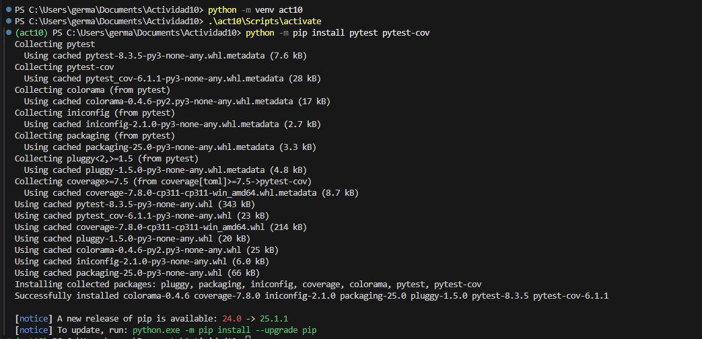

# Actividad 10

## **Paso 1: Instalando pytest y pytest-cov**

- creamos un entorno virtual  para poder instalar pytest, para que se pueda ejecutar pruebas y pytest-cov para generar informes de cobertura de código

# **Paso 2: Escribiendo y ejecutando pruebas con pytest**

-  Se ejecutaron los pruebas con `pytest -v` para validar la funcion de area de un triangulo con diversos casos. Todas las pruebas pasaron

## **Paso 3: Añadiendo cobertura de pruebas con pytest-cov**

- las pruebas se ejecuto con  `pytest --cov=triangle`, como resultado nos da una cobertura del 100% para el archivo `triangle.py` ademas todas las pruebas pasaron sin errores
    
    
    
- usando el comando `pytest --cov=triangle --cov-report=html` se ejcuta las pruebas y esto genera un informe de cobertura en HTML del archivo `triangle.py`.
    
    
    

## **Paso 4: Añadiendo colores automáticamente**

- Se ejecuta `pytest` para verificar si los colores aparecen por defecto.
- si es que en caso no hay, entonces tenemos que forzarlo usando el comando `pytest --color=yes`.

