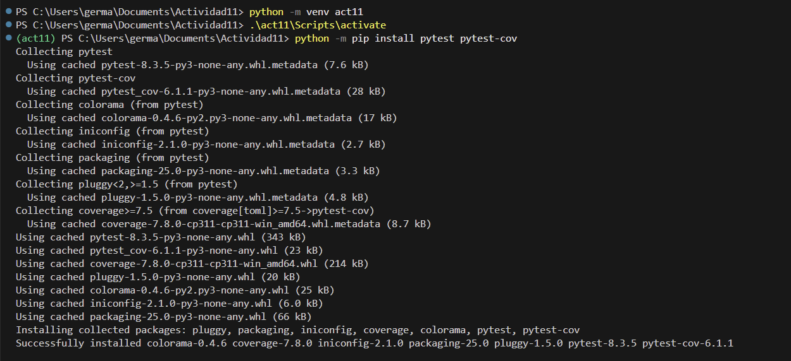

imagenes/ # Actividad 11

## **Paso 1: Instalación de pytest y pytest-cov**

- creamos el entorno virtual para luego instalar la herramient con el comando `python -m pip install pytest pytest-cov`
    
    
    

---

## **Paso 2: Archivos de prueba**

- las pruebas se ejecutan utilzando el comando `pytest` , se puede ver que todas pasaron correctamente. Se realizaron pruebas sobre las funciones `is_empty()`, `peek()`, `pop()`, y `push()` de la clase `Stack`
    
    
    
- al usar el comando `pytest -x` , se ejecutan las pruebas, pero al encontrar el primer fallo se detiene, pero en este caso todas las pruebas pasasaron
    
    
    
- Al ejecutar `pytest --exitfirst`, las pruebas se ejecutan, la ejecucion se detiene en el primer fallo. En este caso, todas las pruebas pasaron
    
    
    
- Al ejecutar `pytest --random-order`, las pruebas se realiza en orden aleatorio. A pesar de la ejecución aleatoria, todas las pruebas pasaron correctamente
    
    
    

---

## **Paso 3: Escribiendo aserciones para el método `is_empty()`**

- modificando las funciones`test_is_empty()` y  `test_pop(self)`

## **Paso 4: Ejecuta pytest para verificar `is_empty()`**

- cuando ejecutamos el comando `pytest -v`  vemos q el test falla, y eso es por que falta 
agrega `self` como primer argumento del método `test_is_empty`
    
    
    
- lo corregimos el error

- ejecutamos denueve el comando `pytest -v`
    
    
    

---

## **Paso 5: Escribiendo aserciones para el método `peek()`**

- modificamos el siguiente metodo
    - Este método devuelve el valor en la parte superior de la pila sin eliminarlo.
    
    
    
- ejecutamos las pruebas
    - La función `test_peek`verifica el comportamiento del método `peek`de la clase `Stack`. Confirma que `peek`devuelve el yltimo elemento agregado sin eliminarlo.Asegura que el estado de la pila no cambia tras llamar a `peek`
    
    
    

## **Paso 6: Escribiendo aserciones para el `método pop()`**

- modificando la funcion `test_pop()`  y explicar que es lo que hace el nuevo funcion}
- modificando la funcion test_pop() y esto verifica que pop() elimine y devuelva el último elemento agregado y que peek() muestre el nuevo tope.
    
    
    
- Se ejecuto las pruebas con el comando `pyest -v` . Todas las funciones pasaron correctamente.
    
    
    

## **Paso 7: Escribiendo aserciones para el `método push()`**

- el metodo `push()`, que añade un valor a la pila.
    
    
    
    - se ejecuto las pruebas. todo paso de manera correcta
    
    
    

## **Paso 8: Ejecuta pytest para verificar todas las pruebas** Ejecuta pytest nuevamente para asegurarte de que todas las pruebas pasan:

- ejecutnado el comando `pytest -v`  para verificar si las pruebas pasaron
    
    
    
    - Como se puede ver, todas las pruebas han pasado correctamente. Se verificaron los métodos `is_empty()`, `peek()`, `pop()` y `push()`, y todos mostraron el comportamiento esperado, pasando las pruebas sin errores

## **Paso 9: Agregando cobertura de pruebas con pytest-cov**

- con el siguiente comando que se ejecuto `pytest --cov=stack --cov-report term-missing` este comando generar un informe de cobertura y verifica cuantas lineas de codigo estan cubiertas por las pruebas
    
    
    
    - El informe muestra que todas las líneas de código están cubiertas al 100%