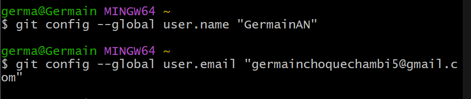

# Actividad 4

## git config

antes de comenzar con git, primero me presento 




## git init

se usa para inicializar un nuevo repositorio de igt


## git add

**agregar cambios** al área de *staging* (preparación)


## git status

**untraked files:** git te informa que hay un archivo que auno no se ha dicho que este pendiente 


se usa git add para que un archivo pase de un estado no rastreado a un archivo rastreado

cuando pones git add. git reconoce como un archivo rastreado (staged(preparado))

**git add *.md: rastrea todos los archivos con la extension .md**


## git commit

**registra** cambios que se ha preparado con **git add en el historial del repositorio**


ahora usamos **git status** para ver si todos los cambios en el directorio de trabbajo actual han sido guardados


si es que aparece el mensaje *nothing to commit ****significa que todos los cambios han sido incorporados* 

## git log

muestra una lista de commits, en un orden cronologico, el commit mas resiente se muestra primero


**Pregunta**: Intentemos el comando `git log` en este ejercicio (puedes realizar otra cosa como colocar las cosas en español). Primero, actualiza el archivo `README.md` y crea un nuevo archivo `CONTRIBUTING.md`:


una vez hecho se agrega el codigo en python 

Cuando se confirme en el *log* que está correctamente registrado, está hecho:

```yaml
$ git log --oneline

344a02a (HEAD -> main) Add main.py
b641640 Set up the repository base documentation
a16e562 Initial commit with README.md
```


# Trabajar con ramas: la piedra angular de la colaboracion

## git branch

cra una rama

la rama predeterminada es la main(anteriormente conocida como **master**)

cuando se ejecuta git branch muestra todas las ramas

```yaml
$ git branch
```


## para crear una rama git branch <branch name>

```yaml
$ git branch feature/new-feature
```


una convension para poner nommbres de rama es feature/, bugfix/ o hotfix/

tambien se puede crear una rama a partri de una rama o commit especifico diferente 

```bash
// Crear una rama desde una rama específica
$ git branch <new-branch-name> <base-branch-name>

// Crear una rama desde un commit específico
$ git branch <new-branch-name> <commit-hash>
```

## git checkout/git switch

cambiar entre ramas

**HEAD** se refiere a la **punta** de la **rama en la que estas trabajando activamente**

```bash
// Cambiar a la rama 'feature/new-feature'
$ git checkout feature/new-feature
```


Esta operación cambia la posición de HEAD, la punta de la *rama*, a una *rama* llamada `feature/new-feature`:

El comando `git checkout` da como resultado que la po

### ejemplos adicionales

**Crear una rama desde una rama específica**

```bash
// Verifica el historial de commits para identificar el commit específico
$ git log --oneline

// Crear una nueva rama 'hotfix/bugfix' basada en el commit 'abc1234'
$ git branch hotfix/bugfix abc1234

// Cambia a la nueva rama 'hotfix/bugfix'
$ git checkout hotfix/bugfix
```


`git checkout -b`

crea una rama y cambia de rama


git merge

fusion de ramas

- primero se cambia a la rama que deseas fusiona

```bash
// Ahora, fusiona tu rama de características
$ git merge feature/new-feature
```


## git branch -d:

elimina una rama

una vez que una rama se halla fusionado con exito y ya no es necesaria, se puede eliminar para mantener limpio el repositrio

```bash
// Eliminar una rama local
$ git branch -d feature/new-feature
```


**Preguntas**

- ¿Cómo te ha ayudado Git a mantener un historial claro y organizado de tus cambios?
- ¿Qué beneficios ves en el uso de ramas para desarrollar nuevas características o corregir errores?
- Realiza una revisión final del historial de commits para asegurarte de que todos los cambios se han registrado correctamente.
- Revisa el uso de ramas y merges para ver cómo Git maneja múltiples líneas de desarrollo.

# ejercicios

## ejercicio 1: manejo avanzado de ramas y resolucion de conflictos

### 1. creamos una rama para una caracteristica

- se crea una reama llamda feature/advanced-feature desde la ramam main


### 2. modificamos archivos en la nueva rama

- se edita el archivo [main.py](http://main.py)


- añadimos y confirmamos los cambios en la rama feature/advanced-feature


### 3. simluar un desarrollo paralelo en la rama main

- cambiamos a la rama main


- edito el archivo main.py


- añadimos y confimamos los cambios en la rama main


### 4. intentar fusionar la rama **feature/advanced-feature en main**


### 5. resolver el conflicto de fusion

- git genera un conflixto en main.py. resolver el archiv de manera manual
- despues de resolver. se añade y se commitea


### 6. elminar la rama fusionada

una vez que se haya fusionado con exito y resuelto conflictos, se elimina la rama feature/advanced-feature


## ejercicio 2: Exploracion y manipulacion del historial de commits

### 1. ver el historial detallado de commits

git log, es para explorar el historial de commits


• Examina las diferencias introducidas en cada commit. ¿Qué cambios fueron realizados en cada uno?

### 2. filtrar commits por autor

- muestra los commits por autor


### 3. revertir un commit

si es que un commit mas resiente no deberia de haber eso. se usa **git revert**

```bash
$ git revert HEAD
```

• Verifica que el commit de reversión ha sido añadido correctamente al historial.

### 4. rebase interactivo

se hacer un rebase iterativo para combinar varios commits en uno solo, es util para limpiar el historial

```bash
$ git rebase -i HEAD~3
```


- en el editor que se abre, combina los ultimos tres commits en uno solo utilzando la opcion  **squash**

### 5. visualizacion grafica del historial

```bash
$ git log --graph --oneline --all
```


• Reflexiona sobre cómo el historial de tu proyecto se visualiza en este formato. ¿Qué información adicional puedes inferir?

## 3. creacion y gestion de ramas desde commits especificos

### 1. crear una nueva rama desde un commits especifico

- se usa **—oneline**  para indentificar un commit antigua

```bash
$ git log --oneline
```


Crea una nueva rama `bugfix/rollback-feature` desde ese commit:

```bash
$ git branch bugfix/rollback-feature <commit-hash>
$ git checkout bugfix/rollback-feature
```


### 2. Modificar y confirmar cmabios en la nueva rama

- modificamos el main.py


- añadimos y confirmamos el cambio a la nueva rama


### 3. Fusionar los cmabios en la rama principal


### 5. eliminar la rama bugfix/rollback-feature

- una vez fusionados los cambios, elimina  la rama `bugfix/rollback-feature`


## Ejercicio 4: Manipulacion y restauracion de commits con git reset y git restore

### 1. hacer cambios en el archivo main.py

- se hace un nuevo cambio en el main.py


- añadimos y confirmamos


### 2. usar git reset para deshacer el commit


- Verifica que el commit ha sido eliminado del historial y que el archivo ha vuelto a su estado anterior


### 3. usar git restore para deshacer cambios no confirmados

- cambiamos el [README.md](http://README.md) y no lo confirmamos


- se usa `git restore` para deshacer cambios no confirmados

```bash
$ git restore README.md
```


- verifica que el cambio no confirmado ha sido revertido


## ejercicio 5: Trabajo colaborativo y manejo de pull requests

### objetivo: simular un flujo de trabajo colaborativo utilzando ramas y pull requests

### 1. crear un nuevo repositorio remoto

- usando github o gitloab para crear un nuevo repositorio remoto y clonadlo localmente


### 2. crear una nueva rama para desarrollo de una caracteristica

- crear una nueva rama en un repositorio local
- primero hacemos un Fork


### 3. realizar cambios y enviar la rama al repositorio remoto

- los cambios que se van a realizar son
- enviamos la rama al repositorio remoto


### 4. abrir un pull request

- Abre un Pull Request (PR) en la plataforma remota (GitHub/GitLab) para fusionar `feature/team-feature` con la rama `main`.
- Añade una descripción detallada del PR, explicando los cambios realizados y su propósito.


## esto es la solicitud que me llega

### 5. revisar y fusionar el pull request


- Simula la revisión de código, comenta en el PR y realiza cualquier cambio necesario basado en la retroalimentación.
    
    
    
    
    
- Una vez aprobado, fusiona el PR en la rama `main`.

### 6. elimiar la rama remota y local

- eliminamos la rama tanto local como remotamente, claro despues de la fusion exitosa


## ejercicio 6: cherry-picking y git stash

**Objetivo:** Aprender a aplicar commits específicos a otra rama utilizando `git cherry-pick` y a guardar temporalmente cambios no confirmados utilizando `git stash`.

### 1. hacer cambios en [main.py](http://main.py) y confirmarlos

- Realiza y confirma varios cambios en `main.py` en la rama `main`


### 2. crear una nueva rama y aplicar el commit especifico

Crea una nueva rama `feature/cherry-pick` y aplícale el commit específico:

```bash
$ git branch feature/cherry-pick
$ git checkout feature/cherry-pick
$ git cherry-pick <commit-hash>
```


### 3. guardar temporalmente cambios no confirmados

- hacemos unos cambios en [main.py](http://main.py) pero no los commits


- guarda  temporalmete estos cambios utilzando git stash

