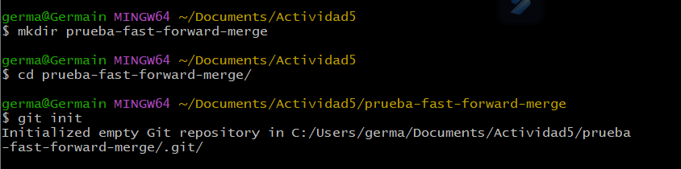

# Actividad 5

# 1. Fusion fast-forward

## creamos un nuevo repositorio

## 2. creamos un archivo en la rama principal (master)

una vez que se crea el archivo se hace git add, esto quiere decir que el archivo en estado modificado a estado preparado, y luego lo confirmamos con un commit

## 

## 3. creamos una nueva rama y lo cambiamos

 `git checkout -b add-description`

## 3. fusionar ramas

primero nos cambiamos a la rama principal que es la rama master y luego se usa `git merge add-description`

vemos el hitorial de como queda despues de hacer la fusion con el comando `git log --graph --oneline`

# 2. **git merge --no-ff- Preserva el historial de las ramas**

comunmente se usa `--no-ff` , estas fusiones genera un nuevo commit de fusion, tiene dos padres este  nuevo comit

## 1. creamos la carpeta y la inicializamos

se crea la carpeta prueba-no-fast-forward-merte, luego se hace `git init`

## 2. creamos un archivo

se crea un archivo para luego poner `git add README.md` , donde el archivo pasa de estar de esatdo modificado a estado preparado, para luego confirmar con el `git commit -m` 

## 3. creamos una nueva rama

Con el comando `git checkout -b add-feature` se crea y se cambia a la rama llamada `add-feature`.

Luego, se modifica el archivo `README.md`, se prepara con el comando `git add`, y se confirma con el comando `git commit -m`.

## 4. ver el historial

con el comando `git log --graph --oneline`

## 5. preparancod merge —no-ff

## 6. ahora vemos el historial

con el comando `git log --graph --oneline`

# 3. git merg —squash

en una fusion squash, todos los commits realiados en la rama caractenisticas se combinan en unico comit en la rama principal. Esta accion de los cambios en esatdo pendiente(sin modficiar), lo que permite revisarlo y modificarlos antes de finalizar el commit 

se pierde los commits indiviuadles 

## 1. inicializamos la carpeta `prueba-squash-merge`  para luego inicializarla

## 2. creamos el archivo README.md

una vez creado el archivo, lo prearparamos el archivo con `git add README.md` , para que pase de estar de estado modificado a estado preparado y confirmarlo con `git commit -m`  

## 3. creamos una nueva rama

una vez creada la rama creamos una archivo [`CONTRIBUTING.md`](http://CONTRIBUTING.md)  para luego preparlo y commitearlo

luebo creamos otro archivo `CONTRIBUTING.MD` 

## 4. vemos el historial

`git log --graph --oneline`

## 5. git mege —squash

los commits de add-basic-files se combina en un solo commit pendeinte 

luego se agrega los cambios no commiteados en la rama main, para haci completar la fusion 

## 6. ver el historial despues del merg —squash

con el comando `git log --graph --oneline`

 

# 4. Resover conflictos en una fusion no-fast-forward

## 1. iniciamos un nuevo repositorio con `git init`

## 2. creamos un archivo index.xml

luego con `git add` el archivo lo pasamos de un estado modificado a un estado preparado para luego commiterarlo

## 3. creamos una nueva rama para luego cambiarnos

## 4. se edita el archivo `index.html`

luego se prepara con `git add`  para confirmarlo con `git commit -m` 

## 5. regresamos en la rama main para realiar un edicion el archivo `index.html`

## 6. Fusiona la rama feature-update con --no-ff y observa el conflicto

luego acemos unos cambios en el archivo

## 7. agregamos el archivo corregido y completamos la fusion

## 9. vemos el historial

con el comando `git log --graph --oneline`

## preguntas:

- ¿Qué pasos adicionales tuviste que tomar para resolver el conflicto?

para resoler el conflixto edite el archivo `index.html`  manualmente, ademas tenie que borrarr  algurnas lineas como >>>>>>>>>>>>>>> y =========

- ¿Qué estrategias podrías emplear para evitar conflictos en futuros desarrollos colaborativos?

Para evitar conflictos en Git, utilizar **ramas separadas** para cada tarea, realizar commits frecente con mensajes cortos y claros y mantener la rama actualizada con los cambios del equipo. ademas de segurarme de revisar codigo antes de fusionar y resuelver los conflictos de inmediato

# ejercicio: **Comparar los historiales con git log después de diferentes fusiones**

## 1. creamos el repositorio

## 2. creamos la carpeta vesion.txt

## 3. creamos una nueva rama y hacemos modificaciones

## 4. regresamos a la rama master para luego crear una nueva rama

## 5. Fusiona feature-1 usando fast-forward

## 6. Fusiona feature-2 usando non-fast-forward y resolvemos el conflicto

 

## 7. creamos una nueva rama feature-3

##