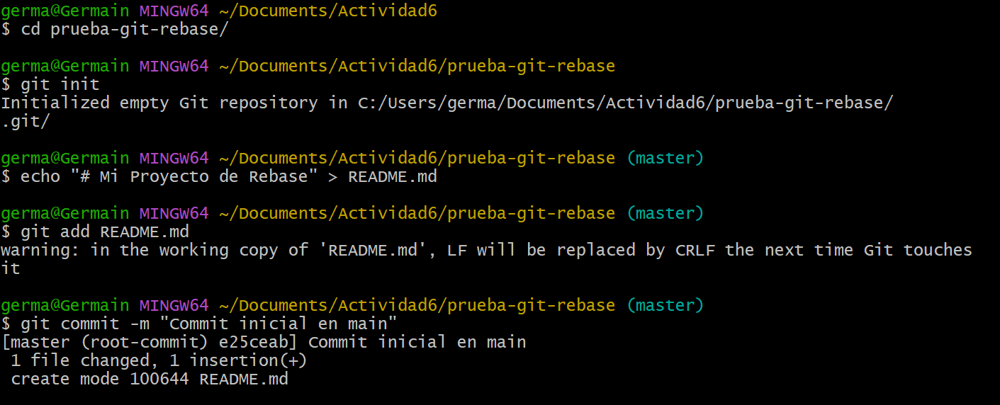

# actividad 6
---
[<<Actividad 5](../Actividad5/ACtividad5.md)
---

# **Parte 1: git rebase para mantener un historial lineal**

## 1. creamos un repositorio git con sus ramas

- iniciamos un nuevo repositorio en el directorio actual com el comando `git init`
- se crea el archivo `README.md`
- se agrega el archivo al area de preparion
- luego se hace el primer commit a la rama master

## 2. crear y cambiar a la rama new-feature

- se crea y cambia a la nueva rama `new-feature`
- se crea el archivo `newFeatue.md`
- se agreaga el archivo al area de preparacion
- se hace un commit en la nueva rama

### pregunta: Presenta el historial de ramas obtenida hasta el momento.

- para ver el historial se usa el comando `git log --graph --oneline`

## 3. agregar nuevos commit a la rama main

- se cambia a la rama `master`
- se crea el archivo update.md
- se agrega al area de preparacion
- luego se commitea

### ver el historial

## tarea: Realiza el rebase de `new-feature` sobre `main` con los siguientes comandos

- se cambia a la rama `new-feature`
- se hace un rebase de `new-feature` sobre `master`

## 4. momento de fusionar y completar el proceso de git rebase

# Parte 2: **git cherry-pick para la integración selectiva de commit**

## 1. iniciamo un nuevo repositorio

## 2. agregamos y commiteamos README.mid

- se crea el archivo `README.md`
- se agrega al arae de preparacion
- se commite el archivo

## 3. se crea una nueva rama y se cambia

## 4. se crea el archivo

- se crea el archio `LICENCE.TXT`
- luego se añade al area de preparcion
- para realizar un commit para registrar el cambio en el historial del repositorio

## 5. rebisamos el historial

## 6. **Tarea: Haz cherry-pick de un commit de add-base-documents a main:**

## 7. revision del historial

### 8. Preguntas de discusion

1. ¿Por qué se considera que rebase es más útil para mantener un historial de proyecto lineal en comparación con merge?
    
    El rebase reaplica los commits sobre la rama base, evitando los commits de fusión (merge), entoces mantien un historial limpio y lineal
    
2. ¿Qué problemas potenciales podrían surgir si haces rebase en una rama compartida con otros miembros del equipo?
    
    hacer un rebase en una rama puede generar conflictos en el historial, ya que el rebase reescribe el historial de la rama, y por consecuencia cambia lso hashes de los commits. ahora si otra persona esta trabajando en esa misma rama, va a tener un historial diferente y podrian tener problemas de sincronizacion al hacer git push
    
3. ¿En qué se diferencia cherry-pick de merge, y en qué situaciones preferirías uno sobre el otro?
    - `cherry-pick` se selecciona un commit especifico de la rama en que estas trabajando y aplicar a otra. no fusiona toda la rama
    - `merge` combina dos ramas, fusionando todos los cambios de una rama en la otra
4. ¿Por qué es importante evitar hacer rebase en ramas públicas?
    
    es importante evitar un `rebase`  en ramas publicas porque reescribe el historial. cambia los hashes de los commits y esto genera confusion y conflixtos con otros colaboradores
    

# ejercicios  teoricos

## **1. Diferencias entre git merge y git rebase**

en `git merge` fusiona las ramas combinando el historial, con un commit de fusion para matener el historial 

en `git rebase` lo que hace es reescribe el historial para que sea un historial lineal

## 2. **Relación entre git rebase y DevOps**

git rabase mantiene un historial lineal lo que facilita la lactura del historial y haci poder hacer seguimientos de errores. ademas reduce los conflictos con los pipelines automatizados. al evitar commits innecesarios de merge.

ademas mejora la implementacion continua(CI/CD) al facilitar integraciones limpias y predecibles, esto hace que disminuye falls en el despliegue automatico

## 3. **Impacto del git cherry-pick en un equipo Scrum**

el `git cherry-pick`  permite mover commits especificos de una rama a la otra rama como main o master sin fusionar todo, esto hace cambios puntuales sin afectar a los demas, pero puede generar conflicto si los commits dependen de otors commtis y complica la sincronizacion 

# Ejercicios Practicos

## 1. **Simulación de un flujo de trabajo Scrum con git rebase y git merge**

- ¿Qué sucede con el historial de commits después del rebase?
    
    despues de hacer un `git rebase`  de la rama feature sobre la rama main, lo que hace es que el historial es limpio y lineal
    
- ¿En qué situación aplicarías una fusión fast-forward en un proyecto ágil?
    
    aplicaria cuando quiero mantener el historial limpio y lineal, si es que no hay cambios en la rama main o master
    

## se crea la carpeta `scrum-workflw`

## Preguntas

**Preguntas:**

- ¿Cómo utilizarías cherry-pick en un pipeline de CI/CD para mover solo ciertos cambios listos a producción?
    
    en un `cherry-pick` nos permite mover solo los comits aprobados aproduccion y haci evitar desplegar codigo malo o incompleto para poder mantener un entorno controlado
    
- ¿Qué ventajas ofrece cherry-pick en un flujo de trabajo de DevOps?
    
    las ventajas que nos ofrecen es integrar cambios especificos sin popder fusionar toda unarmaa esto nos facilidata despliegues rapidos, esto reduce riesgos para para evitar integrar codigos inecesarios
    

## Comandos

### hacer checkout

- primero optenemos los hash de la rama feature

# Fase 1: Planificacion del sprint(Sprint planning)

## Se crea las ramas desde la rama master o main

### **Pregunta:** ¿Por qué es importante trabajar en ramas de funcionalidades separadas durante un sprint?

Trabajar en ramas de funcionalidades separadas es importante ya que de esta manera permite trabajar de manera independiente a los desarroladores, de esta manera estan aisaldos y haci se evitan conflictos de codigos,  como tambien facilita las pruebas unitarias

# Fase 2: **Desarrollo del sprint (sprint execution)**

## **Ejercicio 2: Integración continua con git rebase**

**Pregunta:** ¿Qué ventajas proporciona el rebase durante el desarrollo de un sprint en términos de integración continua?
una de las ventajas es

- tien un historial limpio y lineal
- reduce conflictos cuando se fusionan las ramas
- mejora la eficiencia de CI/CD

# **Fase 3: Revisión del sprint (sprint review)**

## Ejercicio 3: integracion slectiva con `git cherry-pick`

**Objetivo:** Mover commits seleccionados de una rama de funcionalidad (`feature-user-story-2`) a `main` sin integrar todos los cambios.

- para hacer un cherry-pick
    - primero obtenemos el hash de la rama`feature-user-story-2`

ahora cambiamos a la rama master para hacer cherry-pick

**Pregunta:** ¿Cómo ayuda `git cherry-pick` a mostrar avances de forma selectiva en un sprint review?

- nos permiete mostrar solo los avances completos del sprint
- evita incluir codigo incompleto o en desarrollo

# **Fase 4: Retrospectiva del sprint (sprint retrospective)**

**Pregunta**: ¿Cómo manejas los conflictos de fusión al final de un sprint? ¿Cómo puede el equipo mejorar la comunicación para evitar conflictos grandes?

Al final de un sprint, los conflictos de fusion se maneja identificando los archivos que son afectados, resolviendo manualmente los cambios, probando el funcionamiento del código y confirmando los ajustes. Para evitar conflictos grandes, el equipo debe comunicarse constantemente, integrar cambios con frecuencia, coordinar el trabajo en archivos compartidos y utilizar revisiones de código para detectar problemas antes de la integración final.

# **Ejercicio 5: Automatización de rebase con hooks de Git**

¿Qué ventajas y desventajas observas al automatizar el rebase en un entorno de CI/CD?

as ventajas que tien al automatizar el entorno CI/CD es que nos permite tener un historial limpio y lineal, y esto facilita la revision de cambios y la deteccion de errrres, tambie asegura que cada rama se mantenga actualizada con la  rama main o master

la desventeaja es que  es que puede haber conflictos en el momento de hacer rebase, y esto puede haber requerir una intervencion manual, y si se hace rebase sobre rama compartida puede cambiar el historial o sobreescribir el historial y esto genera confusion

---
[<<Actividad 5](../Actividad5/ACtividad5.md)
---
