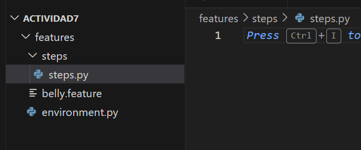

# actividad 7
---
[Link: Repositorio de Actividad 7](https://github.com/GermainAN/ACtividad7.git)
---
# 1. configuramos la carpeta de trabajo

## 2. Se crea la carpeta de entorno virutal de pyhton

## 3. Para ejecutar pruebas `behave`

busca los archivos `.feature` dentro de la carpta `feature`  y ejecutrar los escenarios

## **Ejercicio 1: Añadir soporte para minutos y segundos en tiempos de espera**

## 1. **Modifica** la función que maneja el tiempo de espera en `steps.py`

- primero modficiamos el `pattern`
    - modificando el regex, para  que recnosca los minutos

- aemas agregamos

## 2. Implementando un escenario de preuba

## 3. implementacion de test

## 4. ejecutamos el test

## 5. Integracion de Pipeline  CI/CD

# Ejercicio 2

1. **Modifica** el sistema (la clase `Belly` y los steps en Behave) para que acepte entradas como `"0.5"`, `"2.75"`.

1. **Implementa** un nuevo escenario en Gherkin donde se ingiera una cantidad fraccionaria y verifica el comportamiento.

1. **Valida** que el sistema lance una excepción o error si se ingresa una cantidad negativa de pepinos.

1. **Pruebas unitarias**:
    - Cubre el caso de pepinos fraccionarios en `test_belly.py`.
    - Cubre también el caso de pepinos negativos (se espera un error).

# Ejercicio 3

1. **Modifica** el parsing de tiempo para que reconozca palabras clave en inglés, además de español (por ejemplo, `"two hours"`, `"thirty minutes"`).
    1. acutalizamos la funcion `convertir_palabra_a_numero`  para el ingles 
    
    
    
     b. actualizamos el `step_when_wait_time_description`
    
    
    
2. **Escribe** al menos dos escenarios de prueba en Gherkin que usen tiempos en inglés.
    
    
    

# Ejercicio 4

1. **Crea** una función que, dada una expresión como "entre 1 y 3 horas", devuelva un valor aleatorio entre 1 y 3 horas.
    
    
    
2. **Implementa** un escenario en Gherkin que verifique que, tras comer pepinos y esperar un tiempo aleatorio, el estómago puede gruñir.
    
    
    
3. **Imprime** (en consola o logs) el tiempo aleatorio elegido para que el resultado sea rastreable en tu pipeline.

# Ejercicio 5

