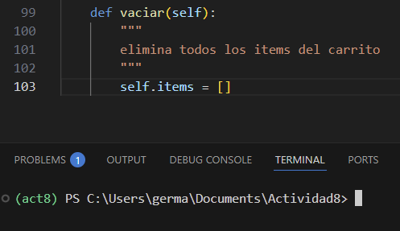

# Actividad 8
---
[Link del repositorio de Actividad 8](https://github.com/GermainAN/Actividad8.git)
---
# **Ejercicio 1: Método para vaciar el carrito**

# **Ejercicio 2: Descuento por compra mínima**

# **Ejercicio 3: Manejo de stock en producto**

# **Ejercicio 4: Ordenar items del carrito**

#